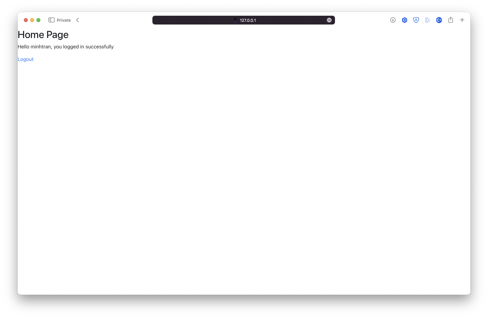

# Blog
## Installation

- mysql
- database for mysql with script to CREATE TABLE provided [create_blog.sql](./create_blog.sql)
- flask and python required packages (Tải pycharm và tải các thư viện cần thiết)

```shell
git clone https://github.com/minh-trancong/Blog.git
```

```shell
python3 -m venv Blog
cd Blog
source bin/activate
pip3 install flask
```

```shell
pip3 install -r requirements.txt
```

```shell
flask run
```

## API

```python
'/api/login', [GET, POST]
'/api/register' [GET, POST]
'/api/update/users/<int:userid>' methods=[PUT]
'/api/users', [GET] -> Get all users
'/api/users/<int:userid>' [GET] -> Get specific user information by his/her id
'/api/delete/users/<int:userid>' [DELETE]
'/api/update/users/<int:userid>' [PUT]
```

```python
'/api/google/login' [GET, POST]
'/api/google/register' [GET, POST]
'/api/google/<int:userid>/occupation' [GET, POST]
'/api/google/checkmail'
'/api/google/callback'
'/api/facebook/register/' [GET, POST] -> register with access_token or login if exists
```

```python
'/api/posts/page=<int:pageid>' [GET]
'/api/posts/<int:id>' [GET, DELETE]
'/api/users/<int:id>/posts' [GET]
'/api/users/<int:id>/posts/create' [POST]
```

```python
'/api/reacts' [GET]
'/api/reacts/posts/<int:postid>' [GET]
'/api/reacts/posts/<int:postid>/likes' [GET]
'/api/reacts/users/<int:userid>/posts/<int:postid>' [GET, POST, DELETE]
```

## INTERACT WITH WEB

- Go to http://127.0.0.1:5000 and experience some features.

|  |  |
| ----------------------------------------------------------- | ----------------------------------------------------------- |
|  |  |


